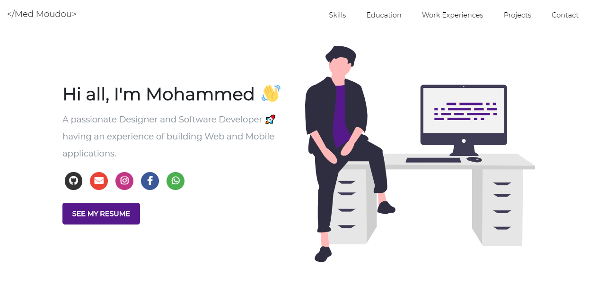

# Software Developer Portfolio 

### A clean, beautiful and responsive portfolio template for Developers!

## Sections 📰

✔️ Summary and About me

✔️ Skills

✔️ Education

✔️ Work Experiences

✔️ Projects 

✔️ Contact me

## Technologies used 🛠️

*    [Bootstrap](https://getbootstrap.com/)
*    [AOS](https://github.com/michalsnik/aos)
*    [FontAwesome](https://fontawesome.com/)

## Illustrations 🖌

*   [UnDraw](https://undraw.co/illustrations)
  
